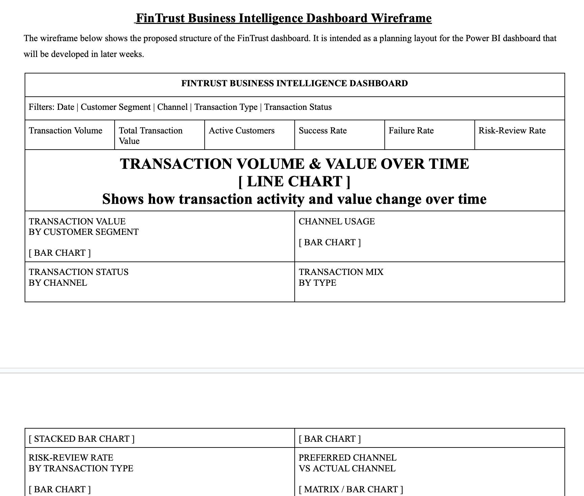
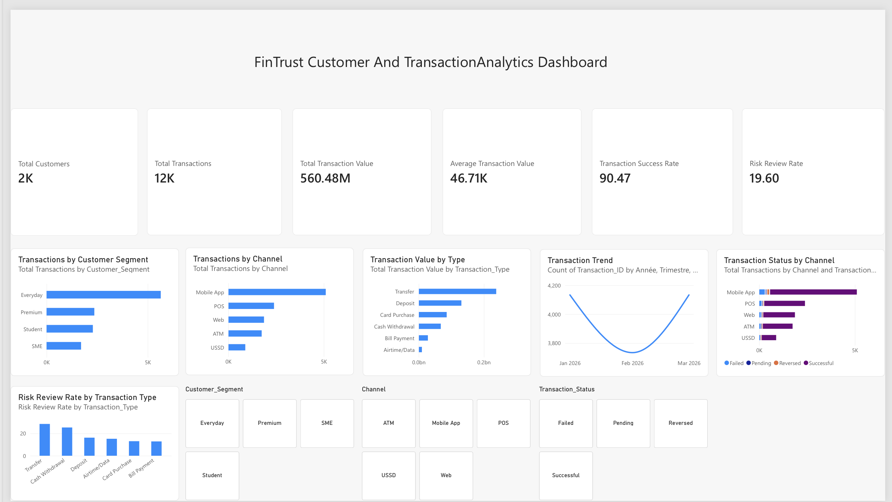

# FinTrust Digital Bank Analytics

This project is part of my Data Analytics internship with AnalystLab Africa.

For Week 1, I worked on the FinTrust Digital Bank case study, where the goal is to understand how customer and transaction data can be turned into useful business intelligence.

## Project Overview

FinTrust is a fictional digital bank looking to better understand customer behaviour, transaction activity, channel usage, operational performance, and risk-related patterns.

My role in the Data Analytics track is to explore the available data, identify useful business questions and KPIs, and plan an analytical dashboard that can support management decisions.

## Data Used

The project uses three main resources:

- FinTrust Customer Data
- FinTrust Transaction Data
- FinTrust Data Dictionary

The customer dataset contains 1,500 customer records, while the transaction dataset contains 12,000 transaction records.

The datasets are linked using `Customer_ID`.

## What I Did in Week 1

During Week 1, I focused mainly on understanding the business problem and getting familiar with the data before moving into deeper analysis.

I:

- reviewed the customer and transaction datasets
- studied the supplied data dictionary
- checked dataset structure and data types
- identified numerical and categorical variables
- checked missing values and duplicates
- validated the Customer_ID relationship between both datasets
- identified initial data-quality observations
- developed analytical questions
- proposed business KPIs
- designed an initial dashboard wireframe
- created a Week 2–4 analysis plan

## Initial Data Observations

Some of the main observations from the profiling stage include:

- 1,500 unique customer records
- 12,000 unique transaction records
- no duplicate customer or transaction IDs
- all transactions successfully link to a valid customer
- Device_Type and Location each contain 96 missing values
- the transaction data covers January to March 2026
- Risk_Review_Flag represents transactions requiring review and should not be interpreted as confirmed fraud

## Proposed KPIs

Some of the KPIs planned for the project include:

- Transaction Volume
- Total Transaction Value
- Average Transaction Value
- Transaction Success Rate
- Transaction Failure Rate
- Active Customer Count
- Channel Adoption Share
- Risk-Review Rate

## Proposed Dashboard

The planned dashboard will provide a high-level view of:

- transaction activity
- transaction value
- customer participation
- channel usage
- transaction success and failure
- customer segment performance
- risk-review patterns

## Next Steps

In Week 2, I plan to:

- prepare the data for analysis
- handle missing values appropriately
- perform exploratory data analysis
- investigate the Week 1 analytical questions
- calculate and validate the proposed KPIs

## Tools

- Python
- Pandas
- Excel
- Power BI
- GitHub

## About the Data

All FinTrust data used in this project is synthetic and was created for educational purposes as part of the AnalystLab Africa Experience Lab Internship Programme so they are not real

## Week 1 Deliverables

-  [Week 1 Data Profiling Notebook](week1_data_profiling.ipynb)
- [Week 1 Business & Data Intelligence Assessment](reports/FinTrust_Week1_Business_Data_Intelligence_Assessment.pdf)

### Dashboard Wireframe

## Week 2: Analyse & Prepare

Week 2 moved the project from planning into practical analysis.

### Work Completed

- Data quality assessment and cleaning in Excel
- SQL analysis covering 8 business questions
- Exploratory data analysis using Python, Pandas, NumPy, Matplotlib and Seaborn
- Initial Power BI management dashboard
- Business findings and testing documentation

### Key Findings

- Mobile App recorded the highest transaction activity with 5,102 transactions.
- Everyday customers generated 5,644 transactions.
- 90.47% of transactions were successful.
- Transfers and card purchases were the most common transaction types.
- 19.6% of transactions were flagged for risk review.

> Risk_Review_Flag is a synthetic educational indicator and does not represent confirmed fraud.

### Week 2 Deliverables

- [Python EDA Notebook](notebooks/FinTrust_Week2_Data_Analysis.ipynb)
- [SQL Analysis](sql/FinTrust_Week2_SQL_Analysis.sql)
- [Week 2 Project Summary](reports/FinTrust_Week2_Project_Summary.pdf)
- [Data Quality & Cleaning Workbook](excel/FinTrust_Week2_Data_Quality_Cleaning.xlsx)

### Power BI Dashboard

## Author

Adegbola Yusuf | 
Data Analytics Intern | 
AnalystLab Africa 
